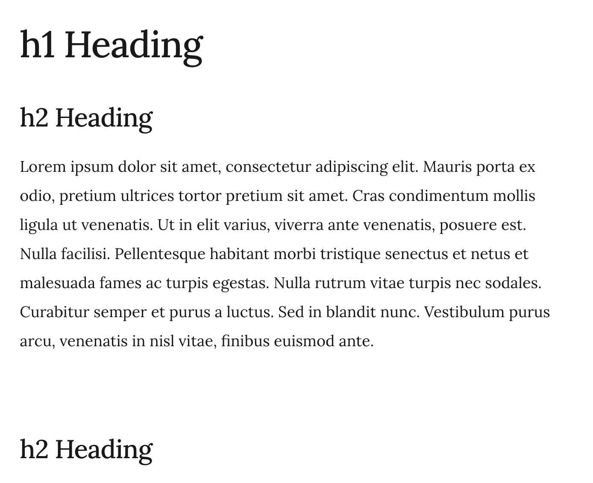

# obsidian-contextual-typography

This plugin adds a `data-tag-name` attribute to all top-level preview `div`s, allowing contextual typography. For example:

```
.markdown-preview-view div[data-tag-name="h1"] + div > h2 {
  margin-top: 1.8888888889rem;
}

.markdown-preview-view div[data-tag-name="h2"] + div > h3,
.markdown-preview-view div[data-tag-name="h3"] + div > h4,
.markdown-preview-view div[data-tag-name="h4"] + div > h5 {
  margin-top: 0.9444444444rem;
}

.markdown-preview-view div[data-tag-name="h5"] + div > h6 {
  margin-top: -0.9444444444rem;
}
```

This is specifically inspired by http://matejlatin.github.io/Gutenberg/

## Sample

**Before:**


**After:**

